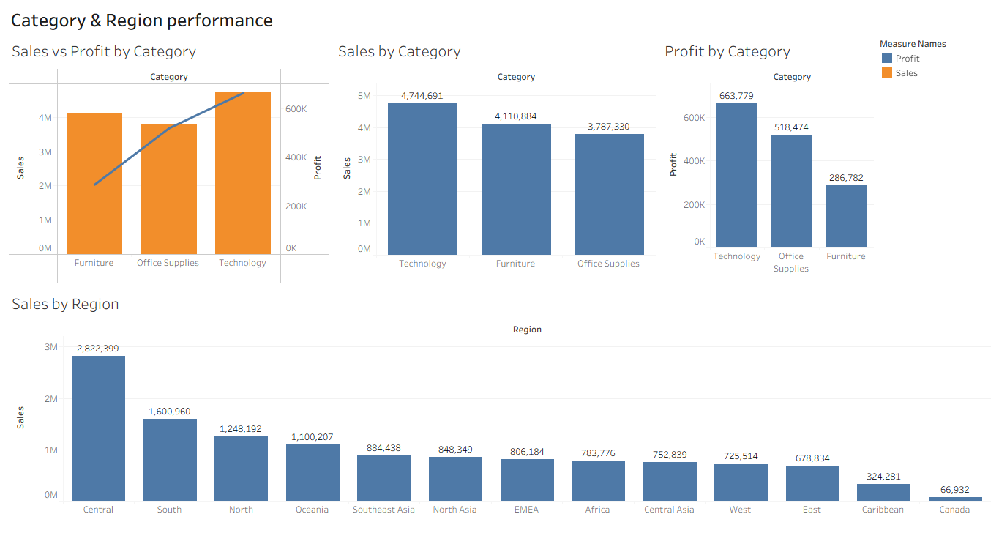
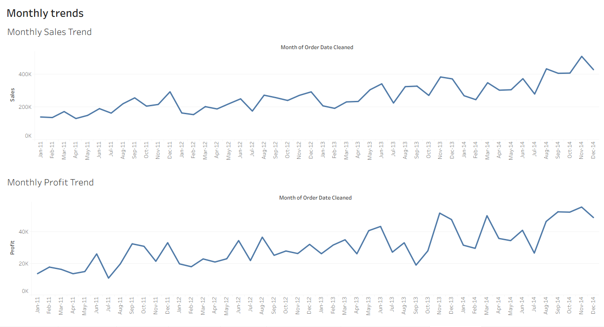

# Sales Data Analysis

## Project Overview

This project analyzes sales data to evaluate business performance across product categories, regions, and time periods.

The project involved data cleaning and preliminary analysis in Microsoft Excel, followed by interactive data visualization and dashboard development in Tableau Public.

The objective was to identify sales and profitability trends and translate the findings into actionable business recommendations.

## Business Questions

The analysis was designed to answer the following questions:

- How do sales and profit change over time?
- Which product categories generate the highest sales and profit?
- Which categories have the strongest profitability?
- Which regions generate the highest sales?
- Are there significant differences between sales and profit performance?
- What business actions can be recommended based on the findings?

## Dataset

The dataset contains **51,290 sales records and 21 columns**, covering information about orders, products, customers, sales, profit, regions, and dates.

## Data Preparation

Microsoft Excel was used for the initial data preparation and analysis. The process included:

- Checking the dataset for missing values
- Checking for duplicate records
- Validating the number of records and columns
- Cleaning and converting date fields
- Creating a cleaned order-date field for time-based analysis
- Calculating profit margin
- Using PivotTables to validate sales, profit, category, regional, and monthly performance

## Tools Used

- **Microsoft Excel** — data cleaning, validation, calculations, and preliminary analysis
- **Tableau Public** — interactive data visualization and dashboard development
- **GitHub** — project documentation and portfolio presentation

## Tableau Dashboards

### Category & Region Performance

This dashboard analyzes sales and profit performance across product categories and geographical regions.

[View Interactive Dashboard on Tableau Public](https://public.tableau.com/views/SalesDataset_17870642752860/CategoryRegionperformance?:language=en-US&publish=yes&:display_count=n&:origin=viz_share_link)

### Monthly Sales & Profit Trends

This dashboard examines monthly sales and profit trends from 2011 to 2014.

[View Interactive Dashboard on Tableau Public](https://public.tableau.com/views/SalesDataset_17870642752860/Monthlytrends?:language=en-US&publish=yes&:display_count=n&:origin=viz_share_link)

## Key Insights

### 1. Monthly Sales and Profit Trends

- Sales fluctuated considerably from month to month between January 2011 and December 2014, with stronger performance generally observed toward the later years.
- November 2014 recorded the highest monthly sales, followed by a decline in December.
- Profit remained positive throughout the period but showed considerable month-to-month variation.
- Profit performance generally strengthened toward the later part of the dataset.

### 2. Category Sales Performance

- Technology was the highest-performing category by sales, generating approximately **$4.74 million**.
- Furniture followed with approximately **$4.11 million** in sales.
- Office Supplies generated approximately **$3.79 million**.
- Technology therefore represented the strongest revenue-generating category.

### 3. Category Profitability

- Technology generated the highest profit at approximately **$663,779**.
- Office Supplies generated approximately **$518,474** in profit.
- Furniture generated approximately **$286,782**, despite recording higher sales than Office Supplies.
- Technology had the highest profit margin at approximately **13.99%**, followed closely by Office Supplies at **13.69%**.
- Furniture had a substantially lower profit margin of approximately **6.90%**, indicating weaker profitability relative to its sales volume.

### 4. Regional Sales Performance

- The **Central region** recorded the highest sales at approximately **$2.82 million**.
- South ranked second with approximately **$1.60 million**, followed by North with approximately **$1.25 million**.
- Sales varied considerably across regions, with Canada recording the lowest sales at approximately **$66,932**.
- The difference between high- and low-performing regions indicates opportunities to investigate regional market performance and growth potential.

### 5. Sales vs. Profit Performance

- Technology demonstrated the strongest overall performance by leading both sales and profit.
- Furniture generated relatively high sales but significantly lower profit, highlighting that higher revenue does not necessarily translate into higher profitability.
- The difference between sales and profit performance suggests that category-level profitability should be considered alongside revenue when evaluating business performance.

## Business Recommendations

1. **Prioritize the Technology category** because it generates the strongest combination of sales and profit.

2. **Investigate Furniture's low profitability** by examining factors such as pricing, discount levels, product costs, and individual product performance.

3. **Strengthen underperforming regions** by investigating differences in customer demand, product mix, pricing, and distribution.

4. **Use monthly trends for planning** by adjusting inventory, marketing, and sales strategies around periods of stronger and weaker performance.

5. **Monitor profit alongside sales** rather than relying on revenue alone when evaluating categories and regions.

6. **Investigate regional differences** to identify specific strategies that could improve performance in weaker markets.

## Project Files

- `Sales_Data_Analysis.xlsx` — Excel workbook containing the data preparation and analysis
- `category-region-dashboard.png` — Category and Region Performance Tableau dashboard
- `monthly-trends-dashboard.png` — Monthly Trends Tableau dashboard

## Conclusion

This project demonstrates the use of Microsoft Excel for data preparation and analysis and Tableau Public for interactive business intelligence and visualization.

The analysis identified Technology as the strongest-performing category, Central as the leading region by sales, and Furniture as an area requiring further investigation because of its relatively low profitability compared with its sales volume.

The project demonstrates an end-to-end analytical workflow from data preparation and exploration to visualization, interpretation, and business recommendations.
